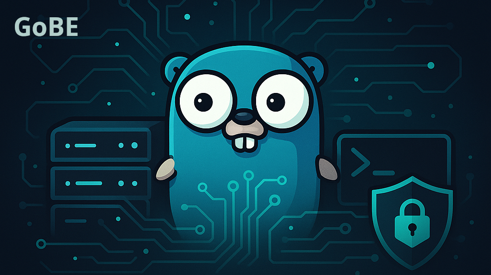

<!-- ---
title: GoBE - Modular & Secure Back-end
version: 1.3.5
owner: kubex
audience: dev
languages: [en, pt-BR]
sources: [internal/module/info/manifest.json, https://github.com/kubex-ecosystem/gobe]
assumptions: []
--- -->

<!-- markdownlint-disable MD013 MD025 -->
# GoBE - Modular & Secure Back-end



[](https://go.dev/)
[](https://github.com/kubex-ecosystem/gobe/blob/main/LICENSE)
[](#features)
[](#features)
[](#features)
[](#mcp-support)
[](#ai-providers)
[](#webhooks)
[](https://github.com/kubex-ecosystem/gobe/blob/main/CONTRIBUTING.md)
[](https://github.com/kubex-ecosystem/gobe/actions/workflows/kubex_go_release.yml)

**Code Fast. Own Everything.** — A modular, secure, and zero-config backend for modern Go applications with full AI integration.

## TL;DR

GoBE is a modular Go backend that runs **with zero configuration** and provides ready-to-use REST APIs, AI providers, webhooks, and MCP (Model Context Protocol). One command = a complete server with authentication, database, 4 AI providers, and integrated system tools.

```bash
make build && ./gobe start  # Zero config, instant backend with AI
curl http://localhost:3666/mcp/tools  # MCP tools ready
curl http://localhost:3666/providers  # OpenAI, Anthropic, Gemini, Groq ready
curl http://localhost:3666/v1/webhooks/health  # Webhook system ready
```

## **Table of Contents**

1. [About the Project](#about-the-project)
2. [Features](#features)
3. [How to Run](#how-to-run)
4. [AI Providers](#ai-providers)
5. [MCP Support](#mcp-support)
6. [Webhooks](#webhooks)
7. [Usage](#usage)
    - [CLI](#cli)
    - [Configuration](#configuration)
8. [API Reference](#api-reference)
9. [Roadmap](#roadmap)
10. [Contributing](#contributing)
11. [Contact](#contact)

---

## **About the Project**

GoBE is a modular backend built with Go that embodies the Kubex principle: **No Lock-in. No Excuses.** It delivers **security, automation, and flexibility** in a single binary that runs anywhere — from your laptop to enterprise clusters.

### **Mission Alignment**

Following Kubex's mission to democratize modular technology, GoBE provides:

- **DX First:** One command starts everything — server, database, authentication, MCP tools
- **Total Accessibility:** Runs without Kubernetes, Docker, or complex setup
- **Module Independence:** Every component (CLI/HTTP/Jobs/Events) is a full citizen

### **Current Status - Production Ready**

✅ **Zero-config:** Auto-generates certificates, passwords, keyring storage
✅ **AI Providers:** OpenAI, Anthropic Claude, Google Gemini, Groq with streaming support
✅ **MCP Protocol:** Model Context Protocol with dynamic tool registry and shell commands
✅ **Webhook System:** Functional webhook processing with AMQP integration and retry logic
✅ **Discord Integration:** Real MCP tool execution via Discord bot with formatted responses
✅ **Modular Architecture:** Clean interfaces, exportable via `factory/`
✅ **Database Integration:** PostgreSQL/SQLite via `gdbase` Docker management
✅ **REST API:** Authentication, users, products, clients, jobs, webhooks, AI chat
✅ **Security Stack:** Dynamic certificates, JWT, keyring, rate limiting, whitelisted shell commands
✅ **CLI Interface:** Complete management via Cobra commands
✅ **Multi-platform:** Linux, macOS, Windows (AMD64, ARM64)
✅ **Testing:** Unit tests + integration tests for MCP endpoints and providers
✅ **CI/CD:** Automated builds and releases

## **Project Evolution**

GoBE has evolved from a simple backend server to a comprehensive AI-integrated platform. **Version 1.3.5** represents a significant milestone with the addition of:

### **Recent Major Additions (v1.3.5)**

- **🤖 Full AI Provider Ecosystem:** Complete integration with 4 major AI providers
- **🔗 Real Discord MCP Integration:** Transform Discord bots from placeholder to functional AI tools
- **📬 Production Webhooks:** Fully functional webhook system with persistence and retry logic
- **⚡ Streaming AI Responses:** Real-time AI chat with Server-Sent Events
- **🔧 Enhanced MCP Tools:** Shell command execution with security whitelisting

The system now serves as a **complete AI backend solution**, enabling developers to build AI-powered applications without complex infrastructure setup. The modular architecture makes it suitable for everything from personal projects to enterprise applications.

---

## **Features**

### **🤖 AI Integration**

✨ **4 AI Providers Ready**
- **OpenAI** (GPT-3.5, GPT-4 series) with customizable base URLs
- **Anthropic Claude** (3.5 Sonnet, Opus, Haiku) with streaming support
- **Google Gemini** (1.5 Pro, Flash) with proper cost calculation
- **Groq** (Llama, Mixtral models) with ultra-fast inference

🎯 **Smart Provider Management**
- Dynamic provider switching and availability checks
- External API key support per request
- Automatic cost estimation and usage tracking
- Streaming responses with Server-Sent Events

### **🔧 System Integration**

✨ **MCP Protocol (Model Context Protocol)**
- Dynamic tool registry with thread-safe execution
- Built-in system monitoring tools
- Shell command execution with security whitelisting
- Discord bot integration with real tool functionality

📬 **Production Webhook System**
- AMQP/RabbitMQ integration for async processing
- Persistent webhook storage with retry logic
- Specialized handlers (GitHub, Discord, Stripe, etc.)
- RESTful management API with pagination

### **🏗️ Core Platform**

✨ **Fully modular**
- All logic follows well-defined interfaces, ensuring encapsulation
- Can be used as a server or as a library/module
- Factory pattern for all major components

🔒 **Zero-config, but customizable**
- Runs without initial configuration, but supports customization via files
- Automatically generates certificates, passwords, and secure settings
- Environment variable override support

🔗 **Direct integration with `gdbase`**
- Database management via Docker
- Automatic optimizations for persistence and performance
- Multi-database support (PostgreSQL, SQLite)

🛡️ **Advanced authentication**
- Dynamically generated certificates
- Random passwords and secure keyring
- JWT token management with refresh logic

🌐 **Comprehensive REST API**
- AI chat endpoints with streaming
- Webhook management and monitoring
- Authentication, user management, products, clients
- System health and metrics

📋 **Enterprise-grade monitoring**
- Protected routes, secure storage, and request monitoring
- Real-time system metrics via MCP tools
- Connection health checks (DB, AMQP, webhooks)

🧑‍💻 **Powerful CLI**
- Commands to start, configure, and monitor the server
- Zero-config startup with detailed logging

---

## **How to Run**

**One Command. All the Power.**

### Quick Start

```bash
# Clone and build
git clone https://github.com/kubex-ecosystem/gobe.git
cd gobe
make build

# Start everything (zero config)
./gobe start

# Server ready at http://localhost:3666
# MCP endpoints: /mcp/tools, /mcp/exec
# Health check: /health
```

### Requirements

- **Go 1.25+** (for building from source)
- **Docker** (optional, for advanced database features)
- **API Keys** (optional, for AI providers - can be set per request)
- **No Kubernetes, no complex setup required**

### Build Options

```bash
make build          # Production build
make build-dev      # Development build
make install        # Install binary + environment setup
make clean          # Clean artifacts
make test           # Run all tests
```

---

## **AI Providers**

GoBE includes **4 production-ready AI providers** with streaming support and cost tracking.

### **Available Providers**

| Provider | Models | Features | Pricing |
|----------|--------|----------|---------|
| **OpenAI** | GPT-3.5, GPT-4, GPT-4o | Streaming, custom base URL | $0.002-$0.03 per 1K tokens |
| **Anthropic** | Claude 3.5 Sonnet, Opus, Haiku | Streaming, long context | $0.25-$75 per 1M tokens |
| **Google Gemini** | Gemini 1.5 Pro, Flash | Streaming, multimodal | $0.075-$10.50 per 1M tokens |
| **Groq** | Llama 3.1, Mixtral | Ultra-fast inference | $0.05-$0.79 per 1M tokens |

### **Usage Examples**

#### **List Available Providers**
```bash
curl http://localhost:3666/providers
```

#### **Chat with Streaming**
```bash
curl -X POST http://localhost:3666/chat \
  -H "Content-Type: application/json" \
  -d '{
    "provider": "openai",
    "model": "gpt-4",
    "messages": [{"role": "user", "content": "Hello!"}],
    "stream": true,
    "temperature": 0.7
  }'
```

#### **Provider Switching**
```bash
# Use different providers for different tasks
curl -X POST http://localhost:3666/chat \
  -d '{"provider": "anthropic", "model": "claude-3-5-sonnet-20241022", ...}'

curl -X POST http://localhost:3666/chat \
  -d '{"provider": "groq", "model": "llama-3.1-70b-versatile", ...}'
```

#### **External API Keys**
```bash
# Use your own API key for a specific request
curl -X POST http://localhost:3666/chat \
  -H "X-External-API-Key: your-api-key-here" \
  -d '{"provider": "openai", ...}'
```

### **Provider Configuration**

Configure providers via environment variables or config files:

```bash
# Environment Variables
export OPENAI_API_KEY="sk-..."
export ANTHROPIC_API_KEY="sk-ant-..."
export GEMINI_API_KEY="..."
export GROQ_API_KEY="gsk_..."

# Custom Base URLs (for OpenAI-compatible endpoints)
export OPENAI_BASE_URL="https://api.groq.com"
```

### **Cost Tracking**

Each response includes cost estimation:

```json
{
  "content": "Response text...",
  "usage": {
    "prompt_tokens": 10,
    "completion_tokens": 20,
    "total_tokens": 30,
    "latency_ms": 1500,
    "cost_usd": 0.0006,
    "provider": "openai",
    "model": "gpt-4"
  }
}
```

---

## **MCP Support**

GoBE implements the **Model Context Protocol (MCP)** for seamless AI tool integration.

### Available Endpoints

```bash
GET  /mcp/tools     # List available tools
POST /mcp/exec      # Execute tools
```

### Built-in Tools

| Tool | Description | Args | Features |
|------|-------------|------|----------|
| `system.status` | Comprehensive system status with metrics | `detailed: boolean` | Runtime stats, memory usage, connection health |
| `shell.command` | Execute safe shell commands | `command: string, args: array` | Whitelisted commands, 10s timeout, output capture |

### Example Usage

#### **List Available Tools**
```bash
curl http://localhost:3666/mcp/tools
```

#### **System Status (Basic)**
```bash
curl -X POST http://localhost:3666/mcp/exec \
  -H "Content-Type: application/json" \
  -d '{"tool": "system.status", "args": {"detailed": false}}'
```

#### **System Status (Detailed)**
```bash
curl -X POST http://localhost:3666/mcp/exec \
  -H "Content-Type: application/json" \
  -d '{"tool": "system.status", "args": {"detailed": true}}'
```

#### **Execute Shell Commands**
```bash
# List files
curl -X POST http://localhost:3666/mcp/exec \
  -H "Content-Type: application/json" \
  -d '{"tool": "shell.command", "args": {"command": "ls", "args": ["-la"]}}'

# Check system info
curl -X POST http://localhost:3666/mcp/exec \
  -H "Content-Type: application/json" \
  -d '{"tool": "shell.command", "args": {"command": "uname", "args": ["-a"]}}'

# Check disk usage
curl -X POST http://localhost:3666/mcp/exec \
  -H "Content-Type: application/json" \
  -d '{"tool": "shell.command", "args": {"command": "df", "args": ["-h"]}}'
```

### **Security Features**

- **Whitelisted Commands:** Only safe commands are allowed (`ls`, `pwd`, `date`, `uname`, etc.)
- **Timeout Protection:** All commands timeout after 10 seconds
- **Error Handling:** Proper error capture and reporting
- **Admin Authentication:** Shell commands require admin privileges

### MCP Architecture

- **Dynamic Registry:** Tools registered at runtime, no restart needed
- **Thread-Safe:** Concurrent tool execution with RWMutex protection
- **Extensible:** Add custom tools via the Registry interface
- **Integrated:** Uses existing manage controllers for system data

---

## **Webhooks**

GoBE provides a **production-ready webhook system** with persistence, retry logic, and AMQP integration.

### **Features**

- ✅ **Persistent Storage:** In-memory storage with plans for database persistence
- ✅ **AMQP Integration:** Async processing via RabbitMQ
- ✅ **Retry Logic:** Automatic retry of failed webhook events
- ✅ **Specialized Handlers:** GitHub, Discord, Stripe, generic webhooks
- ✅ **RESTful API:** Complete CRUD operations with pagination
- ✅ **Real-time Stats:** Monitor webhook processing in real-time

### **Available Endpoints**

| Method | Endpoint | Description |
|--------|----------|-------------|
| `POST` | `/v1/webhooks` | Receive webhook events |
| `GET` | `/v1/webhooks/health` | Webhook system health + stats |
| `GET` | `/v1/webhooks/events` | List webhook events (paginated) |
| `GET` | `/v1/webhooks/events/:id` | Get specific webhook event |
| `POST` | `/v1/webhooks/retry` | Retry all failed webhook events |

### **Usage Examples**

#### **Receive Webhooks**
```bash
# Generic webhook
curl -X POST http://localhost:3666/v1/webhooks \
  -H "Content-Type: application/json" \
  -H "X-Webhook-Source: github" \
  -H "X-Event-Type: push" \
  -d '{"repository": "my-repo", "commits": [...]}'
```

#### **Check System Health**
```bash
curl http://localhost:3666/v1/webhooks/health
```
**Response:**
```json
{
  "status": "ok",
  "timestamp": "2025-01-20T12:00:00Z",
  "stats": {
    "total_events": 150,
    "processed_events": 145,
    "failed_events": 3,
    "pending_events": 2,
    "uptime_seconds": 3600,
    "amqp_connected": true
  }
}
```

#### **List Webhook Events**
```bash
# All events (paginated)
curl "http://localhost:3666/v1/webhooks/events?limit=10&offset=0"

# Filter by source
curl "http://localhost:3666/v1/webhooks/events?source=github&limit=20"
```

#### **Get Event Details**
```bash
curl http://localhost:3666/v1/webhooks/events/123e4567-e89b-12d3-a456-426614174000
```

#### **Retry Failed Events**
```bash
curl -X POST http://localhost:3666/v1/webhooks/retry
```
**Response:**
```json
{
  "status": "success",
  "retried_count": 3,
  "timestamp": "2025-01-20T12:00:00Z",
  "message": "failed events queued for retry"
}
```

### **Webhook Event Types**

The system provides specialized handling for different webhook types:

| Source | Event Type | Handler Features |
|--------|------------|------------------|
| **GitHub** | `github.push` | Repository info, commit details, AMQP notifications |
| **Discord** | `discord.message` | Channel logging, bot response triggers |
| **Stripe** | `stripe.payment` | Payment processing, user billing updates |
| **Generic** | `user.created` | Welcome emails, profile creation |

### **Integration Examples**

#### **GitHub Integration**
```bash
# Configure GitHub webhook to point to your GoBE instance
# Webhook URL: https://your-server.com/v1/webhooks
# Content-Type: application/json
# Events: push, pull_request, issues

curl -X POST https://your-server.com/v1/webhooks \
  -H "X-GitHub-Event: push" \
  -H "X-Webhook-Source: github" \
  -d @github_push_payload.json
```

#### **Discord Bot Integration**
```bash
# Discord events are automatically processed and can trigger MCP tools
curl -X POST http://localhost:3666/v1/webhooks \
  -H "X-Webhook-Source: discord" \
  -H "X-Event-Type: message" \
  -d '{"channel_id": "123", "content": "!system status", "author": {...}}'
```

### **AMQP Integration**

Webhooks are automatically published to RabbitMQ queues:

- **Exchange:** `gobe.events`
- **Routing Key:** `webhook.received`
- **Queue Bindings:** `gobe.system.events`, `gobe.mcp.tasks`

**AMQP Message Format:**
```json
{
  "id": "uuid",
  "source": "github",
  "event_type": "push",
  "payload": {...},
  "headers": {...},
  "timestamp": "2025-01-20T12:00:00Z",
  "processed": false,
  "status": "received"
}
```

---

## **Usage**

### CLI

Start the main server:

```sh
./gobe start -p 3666 -b "0.0.0.0"
```

This starts the server, generates certificates, sets up databases, and begins listening for requests!

See all available commands:

```sh
./gobe --help
```

**Main commands:**

| Command   | Function                                         |
|-----------|--------------------------------------------------|
| `start`   | Starts the server                                |
| `stop`    | Safely stops the server                          |
| `restart` | Restarts all services                            |
| `status`  | Shows the status of the server and active services|
| `config`  | Generates an initial configuration file          |
| `logs`    | Displays server logs                             |

---

### Configuration

GoBE can run without any initial configuration, but supports customization via YAML/JSON files. By default, everything is generated automatically on first use.

Example configuration:

```yaml
port: 3666
bindAddress: 0.0.0.0
database:
  type: postgres
  host: localhost
  port: 5432
  user: gobe
  password: secure
```

#### Messaging Integrations

WhatsApp and Telegram bots can be configured via the `config/discord_config.json` file under the `integrations` section:

```json
{
  "integrations": {
    "whatsapp": {
      "enabled": true,
      "access_token": "<token>",
      "verify_token": "<verify>",
      "phone_number_id": "<number>",
      "webhook_url": "https://your.server/whatsapp/webhook"
    },
    "telegram": {
      "enabled": true,
      "bot_token": "<bot token>",
      "webhook_url": "https://your.server/telegram/webhook",
      "allowed_updates": ["message", "callback_query"]
    }
  }
}
```

After setting up the file or environment variables, the server will expose the following endpoints:

- `POST /api/v1/whatsapp/send` and `/api/v1/whatsapp/webhook`
- `POST /api/v1/telegram/send` and `/api/v1/telegram/webhook`

Each route also provides a `/ping` endpoint for health checks.

---

## **API Reference**

### **Core Endpoints**

| Category | Method | Endpoint | Description |
|----------|--------|----------|-------------|
| **Health** | `GET` | `/health` | Basic health check |
| **Health** | `GET` | `/healthz` | Kubernetes-style health check |
| **Health** | `GET` | `/status` | Detailed system status |
| **Health** | `GET` | `/api/v1/health` | API health with metrics |

### **AI Provider Endpoints**

| Method | Endpoint | Description | Streaming |
|--------|----------|-------------|-----------|
| `GET` | `/providers` | List all AI providers and availability | ❌ |
| `POST` | `/chat` | Chat with AI providers | ✅ SSE |
| `POST` | `/v1/advise` | Get AI advice/recommendations | ✅ SSE |

### **MCP (Model Context Protocol) Endpoints**

| Method | Endpoint | Description | Auth |
|--------|----------|-------------|------|
| `GET` | `/mcp/tools` | List available MCP tools | Bearer |
| `POST` | `/mcp/exec` | Execute MCP tool | Bearer |

### **Webhook Endpoints**

| Method | Endpoint | Description | Auth |
|--------|----------|-------------|------|
| `POST` | `/v1/webhooks` | Receive webhook events | Bearer |
| `GET` | `/v1/webhooks/health` | Webhook system health | Bearer |
| `GET` | `/v1/webhooks/events` | List webhook events (paginated) | Bearer |
| `GET` | `/v1/webhooks/events/:id` | Get specific webhook event | Bearer |
| `POST` | `/v1/webhooks/retry` | Retry failed webhook events | Bearer |

### **System Monitoring Endpoints**

| Method | Endpoint | Description | Auth |
|--------|----------|-------------|------|
| `GET` | `/api/v1/mcp/system/info` | System information | Bearer |
| `GET` | `/api/v1/mcp/system/cpu-info` | CPU metrics | Bearer |
| `GET` | `/api/v1/mcp/system/memory-info` | Memory metrics | Bearer |
| `GET` | `/api/v1/mcp/system/disk-info` | Disk metrics | Bearer |

### **Scheduler Endpoints**

| Method | Endpoint | Description | Auth |
|--------|----------|-------------|------|
| `GET` | `/health/scheduler/stats` | Scheduler statistics | Bearer |
| `POST` | `/health/scheduler/force` | Force scheduler run | Bearer |

### **Web UI Endpoints**

| Method | Endpoint | Description | Auth |
|--------|----------|-------------|------|
| `GET` | `/` | Serve web UI root | Public |
| `GET` | `/app/*path` | Serve web UI application | Public |

### **Authentication**

GoBE uses **Bearer Token** authentication for protected endpoints:

```bash
# Get token (implementation depends on your auth setup)
TOKEN="your-jwt-token-here"

# Use token in requests
curl -H "Authorization: Bearer $TOKEN" http://localhost:3666/mcp/tools
```

### **Response Formats**

#### **Success Response**
```json
{
  "status": "success",
  "data": { ... },
  "timestamp": "2025-01-20T12:00:00Z"
}
```

#### **Error Response**
```json
{
  "status": "error",
  "message": "Error description",
  "code": 400,
  "timestamp": "2025-01-20T12:00:00Z"
}
```

#### **Streaming Response (SSE)**
```
data: {"content": "Hello", "done": false}

data: {"content": " world!", "done": false}

data: {"done": true, "usage": {"total_tokens": 10, "cost_usd": 0.0002}}
```

### **Rate Limiting**

- **Default:** 100 requests per minute per IP
- **AI Endpoints:** 30 requests per minute per API key
- **Headers:** `X-RateLimit-Limit`, `X-RateLimit-Remaining`, `X-RateLimit-Reset`

### **CORS Support**

CORS is enabled for web UI integration:

```javascript
// JavaScript frontend example
fetch('http://localhost:3666/providers')
  .then(response => response.json())
  .then(providers => console.log(providers));
```

---

## **Roadmap**

### ✅ **Completed (v1.3.5)**

- [x] Full modularization and pluggable interfaces
- [x] Zero-config with automatic certificate generation
- [x] Integration with system keyring
- [x] REST API for authentication and management
- [x] Authentication via certificates and secure passwords
- [x] CLI for management and monitoring
- [x] Integration with `gdbase` for database management via Docker
- [x] **MCP Protocol implementation with dynamic tool registry**
- [x] **Built-in system.status and shell.command tools**
- [x] **Thread-safe tool execution with comprehensive testing**
- [x] **4 AI Providers: OpenAI, Anthropic, Gemini, Groq**
- [x] **Streaming AI responses with cost tracking**
- [x] **Production webhook system with AMQP integration**
- [x] **Discord bot integration with real MCP tools**
- [x] **Complete API documentation with examples**
- [x] Multi-database support (PostgreSQL, SQLite)
- [x] Automated tests and CI/CD

### 🚧 **In Progress (v1.4.0)**

- [ ] Database persistence for webhook events
- [ ] Extended MCP tool library (file operations, network tools)
- [ ] WebSocket support for real-time MCP communication
- [ ] Prometheus integration for monitoring

### 📋 **Planned (v1.5.0+)**

- [ ] Plugin system for external tool registration
- [ ] Advanced security policies and RBAC
- [ ] Grafana integration for metrics visualization
- [ ] Multi-tenant support
- [ ] Advanced AI workflow orchestration
- [ ] Custom middleware support

### 🎯 **Next Milestones**

1. **v1.4.0** - Database persistence, WebSocket MCP, monitoring
2. **v1.5.0** - Plugin system and advanced security
3. **v2.0.0** - Multi-tenant platform with workflow orchestration

---

## **Contributing**

Contributions are welcome! Feel free to open issues or submit pull requests. See the [Contribution Guide](docs/CONTRIBUTING.md) for more details.

---

## **Contact**

💌 **Developer**:
[Rafael Mori](mailto:faelmori@gmail.com)
💼 [Follow me on GitHub](https://github.com/kubex-ecosystem)
I'm open to collaborations and new ideas. If you found the project interesting, get in touch!

---

## **Risks & Mitigations**

• **Zero-config may hide necessary configurations** → Verbose logs + override documentation
• **MCP registry thread-safety** → RWMutex implemented + concurrency tests
• **Dependency on gdbase for DB** → Fallback SQLite always available
• **Certificate auto-generation** → Keyring backup + automatic regeneration

---

## **Next Steps**

1. **Extend MCP tools** - file operations, network diagnostics, database queries
2. **WebSocket MCP** - real-time tool communication for AI agents
3. **Plugin system** - external tool registration via shared libraries
4. **Advanced monitoring** - Prometheus metrics + Grafana dashboards
5. **Security hardening** - RBAC, audit logs, policy enforcement

---

## **Changelog**

### v1.3.5 (2025-01-20)

- ✅ **AI Provider Ecosystem:** Complete OpenAI, Anthropic, Gemini, Groq integration
- ✅ **Streaming AI Responses:** Server-Sent Events with cost tracking
- ✅ **Production Webhooks:** Full webhook system with AMQP and retry logic
- ✅ **Enhanced MCP Tools:** Added shell.command with security whitelisting
- ✅ **Discord Integration:** Real MCP tool execution via Discord bot
- ✅ **Comprehensive API:** Complete REST API with detailed documentation

### v1.3.4 (2024-12-23)

- ✅ MCP Protocol implementation with dynamic registry
- ✅ Built-in system.status tool with runtime metrics
- ✅ Thread-safe tool execution with comprehensive tests
- ✅ Documentation updated following Kubex standards
- ✅ Zero-config MCP endpoints (/mcp/tools, /mcp/exec)
