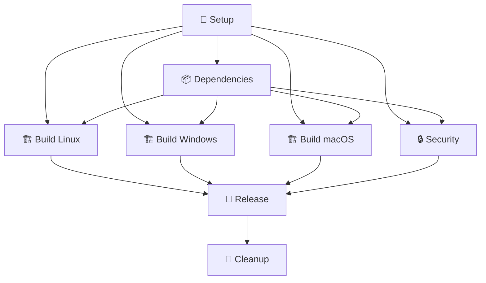

# 🚀 Kubex Release Workflow

## Visão Geral

Este é um workflow de release multi-plataforma de **classe empresarial** que implementa as melhores práticas da indústria para CI/CD com Go. É projetado para ser eficiente, seguro, e servir como referência para outros projetos.

## ✨ Características Premium

### 🎯 **Arquitetura Modular**

- **6 Jobs Especializados**: Cada job tem uma responsabilidade específica
- **Execução Paralela**: Builds para Linux, Windows e macOS executam simultaneamente
- **Dependências Inteligentes**: Jobs só executam quando necessário

### ⚡ **Performance Otimizada**

- **Cache Inteligente**: Cache baseado em hash de dependências
- **Builds Paralelos**: 3 plataformas construídas simultaneamente
- **Cache Multicamada**:
  - Cache de dependências do sistema
  - Cache de módulos Go
  - Cache do build Go

### 🔐 **Segurança Robusta**

- **Scan de Segurança**: Gosec integrado para análise estática
- **Checksums SHA256**: Para todos os artifacts
- **SARIF Upload**: Resultados de segurança no GitHub Security tab
- **Verificação de Tags**: Validação de formato semântico

### 📦 **Distribuição Profissional**

- **Artifacts Organizados**: Estrutura consistente de arquivos
- **Release Notes Automáticas**: Geração automática de notas de lançamento
- **Múltiplos Formatos**: tar.gz para Unix, zip para Windows
- **Metadata Completa**: Informações de build incluídas

## 🏗️ Estrutura dos Jobs



### Job 1: 🔧 Setup & Validation

- **Extração de versão** do tag ou input manual
- **Validação de formato** semântico (vX.Y.Z)
- **Cálculo de chaves de cache** baseado em hashes
- **Setup do ambiente Go**

### Job 2: 📦 Dependencies

- **Cache de dependências** do sistema (apt packages)
- **Cache de módulos Go**
- **Download otimizado** de dependências

### Job 3: 🏗️ Build (Matrix Paralelo)

- **3 Builds simultâneos** para Linux, Windows, macOS
- **Arquivos compactados** em formatos apropriados
- **Checksums automáticos** para cada binary
- **Upload de artifacts** organizados

### Job 4: 🔒 Security

- **Gosec scan** para vulnerabilidades
- **Upload SARIF** para GitHub Security
- **Execução condicional** (pula em workflow_dispatch)

### Job 5: 🎉 Release

- **Download de todos artifacts**
- **Organização de assets**
- **Release notes automáticas** com instruções
- **Release GitHub** com metadata completa

### Job 6: 🧹 Cleanup

- **Limpeza de cache** Go
- **Sumário de execução**
- **Status de todos jobs**

## 🚀 Como Usar

### Release Automático (Recomendado)

```bash
# 1. Commit suas mudanças
git add .
git commit -m "feat: nova funcionalidade incrível"

# 2. Crie e push a tag
git tag v1.2.3
git push origin v1.2.3

# 3. O workflow executa automaticamente! 🎉
```

### Release Manual

1. Vá para **Actions** → **🚀 Kubex Multi-Platform Release**
2. Clique em **Run workflow**
3. Digite a versão (ex: `v1.2.3`)
4. Clique em **Run workflow**

## 📊 Outputs do Workflow

### Artifacts Gerados

```plaintext
kubex-linux-amd64.tar.gz      # Linux x64
kubex-linux-amd64.tar.gz.sha256
kubex-windows-amd64.zip       # Windows x64  
kubex-windows-amd64.zip.sha256
kubex-darwin-amd64.tar.gz     # macOS x64
kubex-darwin-amd64.tar.gz.sha256
SHA256SUMS                    # Checksums consolidados
```

### Release Notes Automáticas

- 📦 **Instruções de instalação** para cada plataforma
- 🔐 **Comandos de verificação** de checksum
- 📊 **Informações de build** (Go version, commit, etc.)
- 🔗 **Links para changelog** completo

## 🛡️ Segurança

### Verificação de Assets

```bash
# Download do checksum
wget https://github.com/rafa-mori/gobe/releases/download/v1.2.3/SHA256SUMS

# Verificação
sha256sum -c SHA256SUMS
```

### Scanning Automático

- **Gosec**: Análise estática de segurança
- **SARIF**: Resultados visíveis no GitHub Security tab
- **Dependencies**: Scan automático de vulnerabilidades em deps

## ⚡ Performance

### Cache Strategy

```yaml
Cache Layers:
├── Sistema (apt packages) → Hash das dependências
├── Go Modules → Hash de go.sum + go.mod  
└── Go Build → Hash de arquivos + versão Go
```

### Paralelismo

- **Builds**: 3 plataformas simultâneas
- **Jobs**: Setup, Dependencies e Security executam em paralelo
- **Artifacts**: Upload paralelo de todos os assets

## 🔧 Configuração

### Variáveis de Ambiente

```yaml
GO_VERSION: '1.21'        # Versão Go para builds
REGISTRY: ghcr.io         # Registry para futuras expansões
```

### Secrets Necessários

- `GITHUB_TOKEN`: Automático (não precisa configurar)

### Permissions

```yaml
contents: write     # Para criar releases
packages: write     # Para futuro suporte a containers
id-token: write     # Para assinatura de artifacts
```

## 🎯 Próximas Melhorias

- [ ] **Multi-arch**: ARM64 support
- [ ] **Container Images**: Docker builds paralelos
- [ ] **Code Signing**: Assinatura de binários
- [ ] **Attestation**: SLSA compliance
- [ ] **Notifications**: Slack/Discord integration
- [ ] **Metrics**: Build time tracking

## 📚 Referências

- [GitHub Actions Best Practices](https://docs.github.com/en/actions/learn-github-actions/essential-features-of-github-actions)
- [Go Cross Compilation](https://golang.org/doc/install/source#environment)
- [Semantic Versioning](https://semver.org/)
- [SARIF Format](https://docs.github.com/en/code-security/code-scanning/integrating-with-code-scanning/sarif-support-for-code-scanning)

---

**Criado com ❤️ por Rafael Mori** • *Este workflow é um exemplo de excelência em CI/CD*
